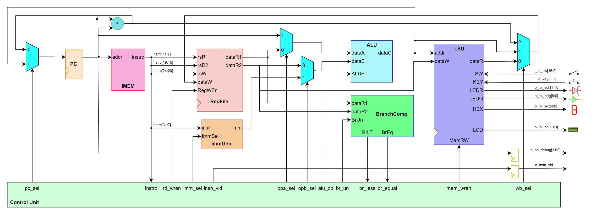
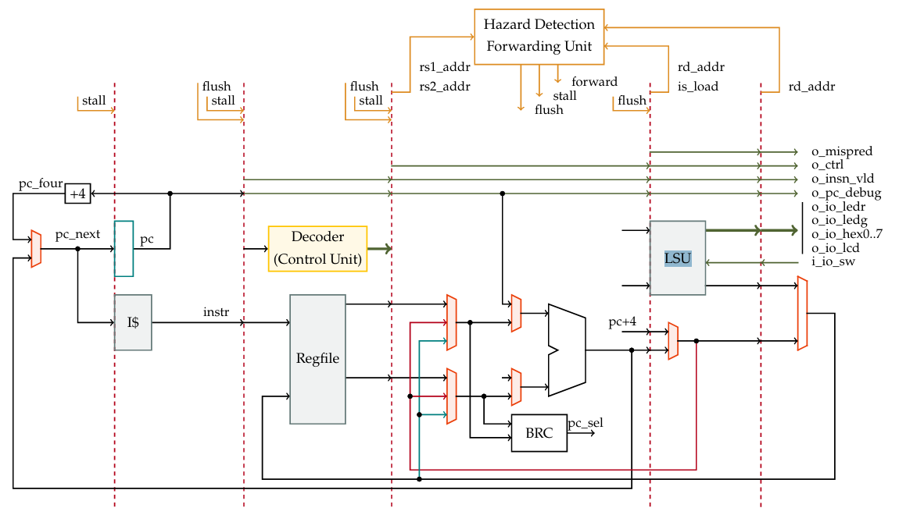
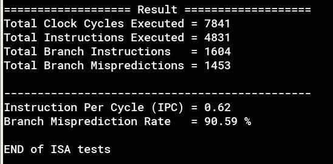
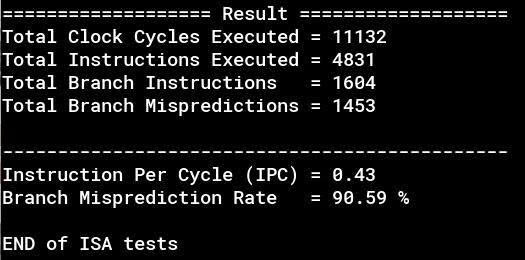

# 32-bit RISC-V Processor (RV32I)

[](https://opensource.org/licenses/MIT)
[](https://riscv.org/)
[](https://en.wikipedia.org/wiki/SystemVerilog)

## 📋 Project Overview

Complete **32-bit RISC-V (RV32I) processor** design and implementation on FPGA, featuring two versions:

1. ⚡ **Single-Cycle Processor** - Basic single-cycle architecture
2. 🚀 **5-Stage Pipeline Processor** - Pipelined architecture with hazard handling

Developed using **SystemVerilog**, simulated on **ModelSim/Questa**, and synthesized using **Intel Quartus Prime** for Cyclone IV/MAX 10 FPGAs (DE2-115/DE10-Lite).

---

## 🎨 Architecture Design

### 1️⃣ Single-Cycle Datapath



**Features:**
- Each instruction executes in **1 clock cycle**
- Simple datapath: Fetch → Decode → Execute → Memory → Write Back
- Lower operating frequency (~50 MHz) due to long critical path

---

### 2️⃣ 5-Stage Pipeline Architecture



**Pipeline Stages:**
- **IF (Instruction Fetch)**: Fetch instruction from memory
- **ID (Instruction Decode)**: Decode instruction and read registers
- **EX (Execute)**: Execute ALU operations
- **MEM (Memory Access)**: Access data memory
- **WB (Write Back)**: Write results to register file

**Pipeline with Forwarding:**



**Pipeline without Forwarding:**



---

## ⚙️ Technical Features

### 📚 Instruction Set Architecture (ISA)

Full support for **RV32I Base Integer Instruction Set** (47 instructions):

| Type | Instructions |
|------|-------------|
| **Arithmetic** | `ADD`, `SUB`, `ADDI` |
| **Logic** | `AND`, `OR`, `XOR`, `ANDI`, `ORI`, `XORI` |
| **Shift** | `SLL`, `SRL`, `SRA`, `SLLI`, `SRLI`, `SRAI` |
| **Compare** | `SLT`, `SLTU`, `SLTI`, `SLTIU` |
| **Load/Store** | `LB`, `LH`, `LW`, `LBU`, `LHU`, `SB`, `SH`, `SW` |
| **Branch** | `BEQ`, `BNE`, `BLT`, `BGE`, `BLTU`, `BGEU` |
| **Jump** | `JAL`, `JALR` |
| **Upper Immediate** | `LUI`, `AUIPC` |

### 🛡️ Hazard Handling (Pipeline)

#### ✅ Data Hazard
- **Forwarding Unit**: Forward data from EX/MEM and MEM/WB stages back to EX stage
- **Bypassing**: Resolves RAW (Read After Write) hazards
- **Load Hazard Detection**: Stall pipeline for 1 cycle when load-use hazard is detected

#### ✅ Control Hazard (Current Implementation)
- **Branch Prediction**: Assume not-taken strategy (simple predictor)
- **Flushing**: Flush instructions in pipeline if branch is taken
- **Branch Target Calculation**: Calculate branch address at EX stage

#### 🚧 Advanced Branch Prediction (In Development)
Developing advanced branch prediction algorithms to optimize performance:

- **G-share Predictor**: Global history-based dynamic predictor with XOR hashing
- **Local Predictor**: Local history table (LHT) for each branch instruction
- **Tournament Predictor**: Meta-predictor combining Global and Local predictors for highest accuracy

> 🎯 **Goal**: Reduce branch penalty from 2-3 cycles to <1 cycle, increase IPC to >1.2

### 🧮 Core Components

- **Register File**: 32 registers of 32-bit each (x0-x31)
- **ALU**: 32-bit Arithmetic Logic Unit with 13 operations
- **LSU (Load-Store Unit)**: Handles aligned/unaligned memory access
- **Branch Comparator**: Comparison unit for branch instructions
- **Immediate Generator**: Generates immediate values for all formats (I, S, B, U, J)

---

## 📁 Project Structure

```
RISC-V-Project/
│
├── docs/                           # 📄 Documentation and design diagrams
│   ├── single_cycle_block.jpg      # Single Cycle block diagram
│   ├── alu_design.jpg              # ALU design
│   ├── lsu.jpg                     # Load-Store Unit
│   ├── regfile.jpg                 # Register File
│   └── KTMT_L01_Group_23.pdf       # Detailed report
│
├── rtl/                            # 💻 Source Code (SystemVerilog)
│   │
│   ├── single_cycle/               # Phase 1: Single-cycle design
│   │   ├── single_cycle.sv         # Top module
│   │   ├── alu.sv                  # Arithmetic Logic Unit
│   │   ├── regfile.sv              # Register File (32x32-bit)
│   │   ├── control_logic.sv        # Control Unit
│   │   ├── immgen.sv               # Immediate Generator
│   │   ├── lsu.sv                  # Load-Store Unit
│   │   ├── inst_mem.sv             # Instruction Memory
│   │   ├── brc.sv                  # Branch Comparator
│   │   └── ...                     # Supporting modules
│   │
│   └── pipeline/                   # Phase 2: Pipeline design
│       │
│       ├── model1_non_forwarding/  # Model 1: Without forwarding
│       │   ├── pipelined.sv        # Pipeline top module
│       │   ├── fetch_stage.sv      # IF Stage
│       │   ├── decode_stage.sv     # ID Stage
│       │   ├── execute_stage.sv    # EX Stage
│       │   ├── mem_stage.sv        # MEM Stage
│       │   ├── wb_stage.sv         # WB Stage
│       │   ├── hazard_detection_load.sv  # Hazard Detection
│       │   ├── stage_*.sv          # Pipeline Registers
│       │   └── ...
│       │
│       └── model2_forwarding/      # Model 2: With data forwarding
│           ├── pipelined.sv        # Top module with forwarding
│           ├── forward_control.sv  # Forwarding Control Unit
│           ├── hazard_detection_load.sv
│           ├── stage_*.sv          # Pipeline Registers (IF/ID, ID/EX, EX/MEM, MEM/WB)
│           └── ...
│
└── simulation/                     # 🧪 Testbench and Verification
    │
    ├── tb_single_cycle/            # (Single cycle testbench if available)
    │
    └── tb_pipeline/                # Pipeline testbench
        ├── model1_non_forwarding/
        │   ├── tbench.sv           # Top testbench
        │   ├── driver.sv           # Driver module
        │   ├── scoreboard.sv       # Scoreboard
        │   └── tlib.svh            # Test library
        │
        └── model2_forwarding/
            ├── tbench.sv
            ├── driver.sv
            ├── scoreboard.sv
            └── tlib.svh
```

---

## 📊 Performance Comparison

| Metric                  | Single Cycle | Pipeline (No Forward) | Pipeline (Forward) |
|-------------------------|--------------|----------------------|-------------------|
| **CPI (Cycles Per Inst)**| 1.0         | ~1.3                 | ~1.1              |
| **Max Frequency**       | ~50 MHz      | ~100 MHz             | ~95 MHz           |
| **IPC (Inst Per Cycle)**| 1.0          | ~0.77                | ~0.91             |
| **Throughput**          | Low          | Medium               | **High**          |
| **Area (Logic Elements)**| ~2,500 LEs  | ~3,200 LEs           | ~3,500 LEs        |

> **Testing Platform**: Intel Quartus Prime 20.1 | FPGA: Cyclone IV E (DE2-115) | Simulator: ModelSim-Intel 10.5b


### Performance Comparison

| Metric                  | Single Cycle | Pipeline (No Forward) | Pipeline (Forward) |
|-------------------------|--------------|----------------------|-------------------|
| **CPI (Cycles Per Inst)**| 1.0         | ~1.3                 | ~1.1              |
| **Max Frequency**       | ~50 MHz      | ~100 MHz             | ~95 MHz           |
| **IPC (Inst Per Cycle)**| 1.0          | ~0.77                | ~0.91             |
| **Throughput**          | Low          | Medium               | **High**          |
| **Area (Logic Elements)**| ~2,500 LEs  | ~3,200 LEs           | ~3,500 LEs        |

> **Testing Platform**: Intel Quartus Prime 20.1 | FPGA: Cyclone IV E (DE2-115) | Simulator: ModelSim-Intel 10.5b

---

## 📖 Instruction Set Support

### Supported Instructions (RV32I)

#### Arithmetic & Logic:
- `ADD`, `SUB`, `AND`, `OR`, `XOR`, `SLL`, `SRL`, `SRA`
- `ADDI`, `ANDI`, `ORI`, `XORI`, `SLLI`, `SRLI`, `SRAI`
- `SLT`, `SLTU`, `SLTI`, `SLTIU`
- `LUI`, `AUIPC`

#### Memory Access:
- **Load**: `LB`, `LH`, `LW`, `LBU`, `LHU`
- **Store**: `SB`, `SH`, `SW`

#### Control Flow:
- **Branch**: `BEQ`, `BNE`, `BLT`, `BGE`, `BLTU`, `BGEU`
- **Jump**: `JAL`, `JALR`

---

## 🚀 Getting Started

### System Requirements

- **Simulator**: ModelSim-Intel / Questa Sim
- **Synthesis Tool**: Intel Quartus Prime (≥ 20.1)
- **Target FPGA**: Cyclone IV E / MAX 10 (DE2-115 / DE10-Lite)
- **Language**: SystemVerilog (IEEE 1800-2012)

### Running Simulation

#### 1. Single-Cycle Processor:
```bash
cd rtl/single_cycle/
vlog -sv *.sv
vsim -c single_cycle -do "run -all; quit"
```

#### 2. Pipeline Processor (Model 2 - With Forwarding):
```bash
cd rtl/pipeline/model2_forwarding/
vlog -sv *.sv

# Compile testbench
cd ../../simulation/tb_pipeline/model2_forwarding/
vlog -sv *.sv *.svh

# Run simulation
vsim -c tbench -do "run -all; quit"
```

### FPGA Synthesis

1. Open Intel Quartus Prime
2. Create new project, select FPGA target (Cyclone IV or MAX 10)
3. Add files from `rtl/single_cycle/` or `rtl/pipeline/model2_forwarding/`
4. Assign pins according to board constraints (`.sdc` files provided)
5. Compile Design (Analysis & Synthesis → Fitter → Assembler)
6. Program FPGA via USB-Blaster

---

## 📚 References

1. [RISC-V Specifications](https://riscv.org/technical/specifications/) - Official RISC-V ISA Manual
2. [RV32I Base Integer Instruction Set](https://github.com/riscv/riscv-isa-manual) - Instruction Set Reference
3. **Computer Organization and Design: RISC-V Edition** - David Patterson & John Hennessy
4. [RISC-V Reader: An Open Architecture Atlas](http://www.riscvbook.com/) - Free RISC-V eBook

### Detailed Documentation

📄 See [docs/KTMT_L01_Group_23.pdf](docs/KTMT_L01_Group_23.pdf) and [docs/KTMT_L01_Group_23_Milestone_3.pdf](docs/KTMT_L01_Group_23_Milestone_3.pdf) for complete project reports.

---

## 👨‍💻 Author Information

**Student:**
- 👤 **Name**: Nguyen Thanh Phong
- 🏫 **University**: Ho Chi Minh City University of Technology (HCMUT)
- 📧 **Email**: [phongnguyens2468@gmail.com](mailto:phongnguyens2468@gmail.com)
- 💼 **LinkedIn**: [Nguyen Thanh Phong](https://www.linkedin.com/in/nguy%E1%BB%85n-thanh-phong-43b389294/)
- 🔗 **GitHub**: [@PhongSkyper](https://github.com/PhongSkyper)

**Supervisor:**
- 👨‍🏫 **Dr. Tran Hoang Linh**
- 📚 Department of Computer Architecture, Faculty of Computer Science and Engineering
- 🏫 Ho Chi Minh City University of Technology (HCMUT)

**Course**: Computer Architecture - L01  
**Group**: 23  
**Semester**: Fall 2024-2025

---

## 📄 License

MIT License - Free to use for educational purposes.

```
Copyright (c) 2024 Nguyen Thanh Phong

Permission is hereby granted, free of charge, to use, copy, modify, and distribute 
this software for educational purposes.
```

---

## 🌟 Contributing & Contact

For questions, suggestions, or contributions:
- 📬 **Email**: phongnguyens2468@gmail.com
- 🐛 **Issues**: [GitHub Issues](https://github.com/PhongSkyper/RISC-V-Processor/issues)
- 🔀 **Pull Requests**: Welcome! Please follow the coding style.

---

<div align="center">

### ⭐ If you find this project useful, please give it a star! ⭐

**Made with ❤️ by Phong Nguyen | HCMUT**

</div>

