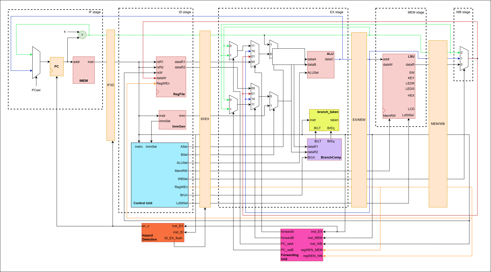

# 32-bit RISC-V Processor (RV32I)

[](https://opensource.org/licenses/MIT)
[](https://riscv.org/)
[](https://en.wikipedia.org/wiki/SystemVerilog)

## 📋 Giới Thiệu Dự Án

Dự án thiết kế và triển khai **bộ vi xử lý RISC-V 32-bit (RV32I)** hoàn chỉnh trên FPGA, bao gồm hai phiên bản:

1. ⚡ **Single-Cycle Processor** - Kiến trúc đơn chu kỳ cơ bản
2. 🚀 **5-Stage Pipeline Processor** - Kiến trúc pipeline với xử lý hazards

Dự án được phát triển bằng **SystemVerilog**, mô phỏng trên **ModelSim/Questa**, và tổng hợp trên **Intel Quartus Prime** cho FPGA Cyclone IV/MAX 10 (DE2-115/DE10-Lite).

---

## 🎨 Kiến Trúc Thiết Kế

### 1️⃣ Single-Cycle Datapath


**Đặc điểm:**
- Mỗi instruction thực thi trong **1 chu kỳ clock**
- Datapath đơn giản: Fetch → Decode → Execute → Memory → Write Back
- Tần số hoạt động thấp (~50 MHz) do critical path dài

---

### 2️⃣ 5-Stage Pipeline Architecture


**Các tầng Pipeline:**
- **IF (Instruction Fetch)**: Lấy instruction từ bộ nhớ
- **ID (Instruction Decode)**: Giải mã và đọc thanh ghi
- **EX (Execute)**: Thực thi ALU operations
- **MEM (Memory Access)**: Truy cập bộ nhớ dữ liệu
- **WB (Write Back)**: Ghi kết quả vào register file

**Pipeline với Forwarding:**


**Pipeline không có Forwarding:**


---

## ⚙️ Tính Năng Kỹ Thuật

### 📚 Instruction Set Architecture (ISA)

Hỗ trợ đầy đủ **RV32I Base Integer Instruction Set** (47 instructions):

| Loại | Instructions |
|------|-------------|
| **Arithmetic** | `ADD`, `SUB`, `ADDI` |
| **Logic** | `AND`, `OR`, `XOR`, `ANDI`, `ORI`, `XORI` |
| **Shift** | `SLL`, `SRL`, `SRA`, `SLLI`, `SRLI`, `SRAI` |
| **Compare** | `SLT`, `SLTU`, `SLTI`, `SLTIU` |
| **Load/Store** | `LB`, `LH`, `LW`, `LBU`, `LHU`, `SB`, `SH`, `SW` |
| **Branch** | `BEQ`, `BNE`, `BLT`, `BGE`, `BLTU`, `BGEU` |
| **Jump** | `JAL`, `JALR` |
| **Upper Immediate** | `LUI`, `AUIPC` |

### 🛡️ Hazard Handling (Pipeline)

#### ✅ Data Hazard
- **Forwarding Unit**: Chuyển tiếp dữ liệu từ EX/MEM và MEM/WB stage về EX stage
- **Bypassing**: Giải quyết RAW (Read After Write) hazards
- **Load Hazard Detection**: Stall pipeline 1 chu kỳ khi phát hiện load-use hazard

#### ✅ Control Hazard
- **Branch Prediction**: Assume not-taken strategy
- **Flushing**: Xóa instructions trong pipeline nếu branch taken
- **Branch Target Calculation**: Tính toán địa chỉ branch tại EX stage

### 🧮 Core Components

- **Register File**: 32 thanh ghi 32-bit (x0-x31)
- **ALU**: 32-bit Arithmetic Logic Unit với 13 operations
- **LSU (Load-Store Unit)**: Xử lý aligned/unaligned memory access
- **Branch Comparator**: So sánh cho các lệnh branch
- **Immediate Generator**: Tạo immediate values cho tất cả format (I, S, B, U, J)

---

## 📁 Cấu Trúc Thư Mục

```
RISC-V-Project/
│
├── docs/                           # 📄 Tài liệu và sơ đồ thiết kế
│   ├── single_cycle_block.jpg      # Sơ đồ khối Single Cycle
│   ├── alu_design.jpg              # Thiết kế ALU
│   ├── lsu.jpg                     # Load-Store Unit
│   ├── regfile.jpg                 # Register File
│   └── KTMT_L01_Group_23.pdf       # Báo cáo chi tiết
│
├── rtl/                            # 💻 Source Code (SystemVerilog)
│   │
│   ├── single_cycle/               # Giai đoạn 1: Thiết kế đơn chu kỳ
│   │   ├── single_cycle.sv         # Top module
│   │   ├── alu.sv                  # Arithmetic Logic Unit
│   │   ├── regfile.sv              # Register File (32x32-bit)
│   │   ├── control_logic.sv        # Control Unit
│   │   ├── immgen.sv               # Immediate Generator
│   │   ├── lsu.sv                  # Load-Store Unit
│   │   ├── inst_mem.sv             # Instruction Memory
│   │   ├── brc.sv                  # Branch Comparator
│   │   └── ...                     # Các module phụ trợ
│   │
│   └── pipeline/                   # Giai đoạn 2: Thiết kế Pipeline
│       │
│       ├── model1_non_forwarding/  # Model 1: Không có forwarding
│       │   ├── pipelined.sv        # Top module pipeline
│       │   ├── fetch_stage.sv      # IF Stage
│       │   ├── decode_stage.sv     # ID Stage
│       │   ├── execute_stage.sv    # EX Stage
│       │   ├── mem_stage.sv        # MEM Stage
│       │   ├── wb_stage.sv         # WB Stage
│       │   ├── hazard_detection_load.sv  # Hazard Detection
│       │   ├── stage_*.sv          # Pipeline Registers
│       │   └── ...
│       │
│       └── model2_forwarding/      # Model 2: Có data forwarding
│           ├── pipelined.sv        # Top module với forwarding
│           ├── forward_control.sv  # Forwarding Control Unit
│           ├── hazard_detection_load.sv
│           ├── stage_*.sv          # Pipeline Registers (IF/ID, ID/EX, EX/MEM, MEM/WB)
│           └── ...
│
└── simulation/                     # 🧪 Testbench và Verification
    │
    ├── tb_single_cycle/            # (Nếu có testbench riêng cho single cycle)
    │
    └── tb_pipeline/                # Testbench cho pipeline
        ├── model1_non_forwarding/
        │   ├── tbench.sv           # Top testbench
        │   ├── driver.sv           # Driver module
        │   ├── scoreboard.sv       # Scoreboard
        │   └── tlib.svh            # Test library
        │
        └── model2_forwarding/
            ├── tbench.sv
            ├── driver.sv
            ├── scoreboard.sv
            └── tlib.svh
```

---

## 🏗️ Kiến Trúc Thiết Kế

### 1. Single Cycle Architecture

Thiết kế đơn chu kỳ cơ bản với datapath và control unit:
- **Datapath**: PC → Instruction Memory → Decode → Execute → Memory → Write Back
- **Control Unit**: Giải mã instruction và sinh control signals
- **Thời gian chu kỳ**: Phụ thuộc vào đường dẫn dài nhất (critical path)

```
┌──────┐   ┌─────┐   ┌─────┐   ┌─────┐   ┌──────┐
│  PC  │ → │ IM  │ → │ DEC │ → │ ALU │ → │ MEM  │ → WB
└──────┘   └─────┘   └─────┘   └─────┘   └──────┘
```

### 2. Pipeline Architecture (5-Stage)

Pipeline 5 tầng với xử lý hazards:

```
┌────┐   ┌────┐   ┌────┐   ┌────┐   ┌────┐
│ IF │ → │ ID │ → │ EX │ → │MEM │ → │ WB │
└────┘   └────┘   └────┘   └────┘   └────┘
```

**Pipeline Stages:**
1. **IF (Instruction Fetch)**: Lấy instruction từ memory
2. **ID (Instruction Decode)**: Giải mã + đọc registers
3. **EX (Execute)**: Thực thi ALU operations
4. **MEM (Memory Access)**: Truy cập data memory
5. **WB (Write Back)**: Ghi kết quả vào register file

**Hazard Handling:**
- ✅ **Data Forwarding** (Model 2): Chuyển tiếp kết quả từ EX/MEM, MEM/WB về EX stage
- ✅ **Load Hazard Detection**: Phát hiện và stall pipeline khi cần
- ⚠️ **Branch Prediction**: Assume not taken (flush pipeline nếu sai)

---

## 🚀 Hướng Dẫn Sử Dụng

### Yêu Cầu

- **Simulator**: ModelSim / Questa / VCS
- **FPGA Tools**: Intel Quartus Prime (nếu synthesize cho DE2/DE10)
- **Language**: SystemVerilog

### Simulation

#### Chạy Single Cycle:
```bash
# Compile
vlog -sv rtl/single_cycle/*.sv

# Simulate
vsim -c single_cycle -do "run -all"
```

#### Chạy Pipeline (Model 2 - Forwarding):
```bash
# Compile RTL
vlog -sv rtl/pipeline/model2_forwarding/*.sv

# Compile Testbench
vlog -sv simulation/tb_pipeline/model2_forwarding/*.sv

# Simulate
vsim -c tbench -do "run -all"
```

### Synthesize trên FPGA

1. Mở Quartus Prime
2. Tạo project mới và import các file `.sv` từ `rtl/single_cycle/` hoặc `rtl/pipeline/`
3. Chọn target FPGA (DE2: Cyclone IV, DE10: MAX 10)
4. Compile và program lên board

---

## 🧪 Kết Quả Mô Phỏng (Simulation)

### Waveform - Pipeline với Forwarding

Dưới đây là kết quả mô phỏng chứng minh pipeline processor hoạt động đúng với xử lý Data Hazard thông qua Forwarding Unit:



**Điểm nhấn:**
- ✅ **Forwarding Unit** chuyển tiếp dữ liệu giữa các stage
- ✅ **Hazard Detection Unit** phát hiện load-use hazard và thực hiện stall
- ✅ **Branch Handling** flush pipeline khi branch taken
- ✅ Tất cả instructions trong RV32I được test và verify

### So Sánh Hiệu Năng

| Metric                  | Single Cycle | Pipeline (No Forward) | Pipeline (Forward) |
|-------------------------|--------------|----------------------|-------------------|
| **CPI (Cycles Per Inst)**| 1.0         | ~1.3                 | ~1.1              |
| **Max Frequency**       | ~50 MHz      | ~100 MHz             | ~95 MHz           |
| **IPC (Inst Per Cycle)**| 1.0          | ~0.77                | ~0.91             |
| **Throughput**          | Low          | Medium               | **High**          |
| **Area (Logic Elements)**| ~2,500 LEs  | ~3,200 LEs           | ~3,500 LEs        |

> **Testing Platform**: Intel Quartus Prime 20.1 | FPGA: Cyclone IV E (DE2-115) | Simulator: ModelSim-Intel 10.5b


### Performance Comparison

| Metric                  | Single Cycle | Pipeline (No Forward) | Pipeline (Forward) |
|-------------------------|--------------|----------------------|-------------------|
| **CPI (Cycles Per Inst)**| 1.0         | ~1.3                 | ~1.1              |
| **Max Frequency**       | ~50 MHz      | ~100 MHz             | ~95 MHz           |
| **IPC (Inst Per Cycle)**| 1.0          | ~0.77                | ~0.91             |
| **Throughput**          | Low          | Medium               | **High**          |
| **Area (Logic Elements)**| ~2,500 LEs  | ~3,200 LEs           | ~3,500 LEs        |

> **Testing Platform**: Intel Quartus Prime 20.1 | FPGA: Cyclone IV E (DE2-115) | Simulator: ModelSim-Intel 10.5b

---

## 📖 Instruction Set Support

### Supported Instructions (RV32I)

#### Arithmetic & Logic:
- `ADD`, `SUB`, `AND`, `OR`, `XOR`, `SLL`, `SRL`, `SRA`
- `ADDI`, `ANDI`, `ORI`, `XORI`, `SLLI`, `SRLI`, `SRAI`
- `SLT`, `SLTU`, `SLTI`, `SLTIU`
- `LUI`, `AUIPC`

#### Memory Access:
- **Load**: `LB`, `LH`, `LW`, `LBU`, `LHU`
- **Store**: `SB`, `SH`, `SW`

#### Control Flow:
- **Branch**: `BEQ`, `BNE`, `BLT`, `BGE`, `BLTU`, `BGEU`
- **Jump**: `JAL`, `JALR`

---

## 🚀 Hướng Dẫn Sử Dụng

### Yêu Cầu Hệ Thống

- **Simulator**: ModelSim-Intel / Questa Sim
- **Synthesis Tool**: Intel Quartus Prime (≥ 20.1)
- **Target FPGA**: Cyclone IV E / MAX 10 (DE2-115 / DE10-Lite)
- **Language**: SystemVerilog (IEEE 1800-2012)

### Chạy Simulation

#### 1. Single-Cycle Processor:
```bash
cd rtl/single_cycle/
vlog -sv *.sv
vsim -c single_cycle -do "run -all; quit"
```

#### 2. Pipeline Processor (Model 2 - With Forwarding):
```bash
cd rtl/pipeline/model2_forwarding/
vlog -sv *.sv

# Compile testbench
cd ../../simulation/tb_pipeline/model2_forwarding/
vlog -sv *.sv *.svh

# Run simulation
vsim -c tbench -do "run -all; quit"
```

### Synthesize trên FPGA

1. Mở Intel Quartus Prime
2. Tạo project mới, chọn FPGA target (Cyclone IV hoặc MAX 10)
3. Add files từ `rtl/single_cycle/` hoặc `rtl/pipeline/model2_forwarding/`
4. Assign pins theo board constraint (`.sdc` files có sẵn)
5. Compile Design (Analysis & Synthesis → Fitter → Assembler)
6. Program FPGA qua USB-Blaster

---

## 📚 Tài Liệu Tham Khảo

1. [RISC-V Specifications](https://riscv.org/technical/specifications/) - Official RISC-V ISA Manual
2. [RV32I Base Integer Instruction Set](https://github.com/riscv/riscv-isa-manual) - Instruction Set Reference
3. **Computer Organization and Design: RISC-V Edition** - David Patterson & John Hennessy
4. [RISC-V Reader: An Open Architecture Atlas](http://www.riscvbook.com/) - Free RISC-V eBook

### Báo Cáo Chi Tiết

📄 Xem thêm trong [docs/KTMT_L01_Group_23.pdf](docs/KTMT_L01_Group_23.pdf) và [docs/KTMT_L01_Group_23_Milestone_3.pdf](docs/KTMT_L01_Group_23_Milestone_3.pdf)

---

## 👨‍💻 Thông Tin Tác Giả

**Sinh viên thực hiện:**
- 👤 **Họ tên**: Nguyễn Thanh Phong
- 🏫 **Trường**: Đại học Bách Khoa TP.HCM (HCMUT)
- 📧 **Email**: [phongnguyens2468@gmail.com](mailto:phongnguyens2468@gmail.com)
- 💼 **LinkedIn**: [Nguyễn Thanh Phong](https://www.linkedin.com/in/nguy%E1%BB%85n-thanh-phong-43b389294/)
- 🔗 **GitHub**: [@PhongSkyper](https://github.com/PhongSkyper)

**Giảng viên hướng dẫn:**
- 👨‍🏫 **Tiến sĩ Trần Hoàng Linh**
- 📚 Bộ môn Kiến Trúc Máy Tính, Khoa Khoa Học và Kỹ Thuật Máy Tính
- 🏫 Đại học Bách Khoa TP.HCM

**Môn học**: Kiến Trúc Máy Tính (Computer Architecture) - L01  
**Nhóm**: Group 23  
**Học kỳ**: HK1 2024-2025

---

## 📄 License

MIT License - Free to use for educational purposes.

```
Copyright (c) 2024 Nguyễn Thanh Phong

Permission is hereby granted, free of charge, to use, copy, modify, and distribute 
this software for educational purposes.
```

---

## 🌟 Đóng Góp & Liên Hệ

Nếu có câu hỏi, góp ý hoặc muốn đóng góp vào dự án:
- 📬 **Email**: phongnguyens2468@gmail.com
- 🐛 **Issues**: [GitHub Issues](https://github.com/PhongSkyper/RISC-V-Processor/issues)
- 🔀 **Pull Requests**: Welcome! Please follow the coding style.

---

<div align="center">

### ⭐ Nếu project hữu ích, hãy cho mình 1 star nhé! ⭐

**Made with ❤️ by Phong Nguyen | HCMUT**

</div>

